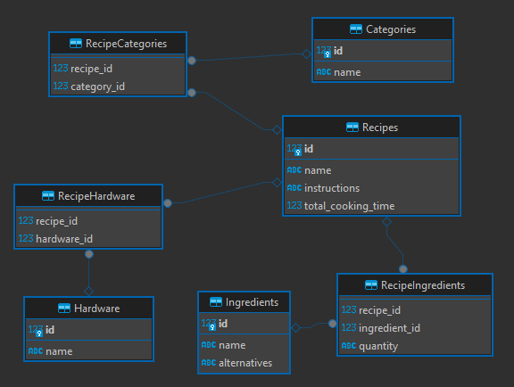

# Tietokanta Projekti


### Description
This project is a Python application that interacts with a SQL database to manage recipes.

### Prerequisites

- Docker

### Project scope

This project is a Python application that uses Docker to manage a SQL database for recipes. The application's source code is located in the src directory, with the main entry point being main.py. The database interactions are handled by the database.py file in the utils directory.

The Docker configuration for the application is defined in the docker-compose.yml file at the root of the project, and the Dockerfile for the application is Dockerfile. There's also a Docker configuration specifically for the Postgres database in the postgres directory.

The SQL queries used by the application are stored in the queries.sql file. The schema for the database is defined in 00-schema.sql, and the script to populate the database with initial data is in 01-populate.sql.

The project's dependencies are listed in the requirements.txt file. To run the application, Docker is required as per the prerequisites in the README.md.


### Running the application

1. Clone the repository
2. Navigate to the project directory
3. Run the following commands

```sh
docker compose build
docker compose up -d postgres
docker compose run tietokanta-projekti
```

### Queries
The queries that are used within the application are located in the [queries.sql](./queries.sql)

### Schema and populate
The schema of the database is located at [./postgres/init/00-schema.sql](./postgres/init/00-schema.sql)
and the populate script at [./postgres/init/01-populate.sql](./postgres/init/01-populate.sql)